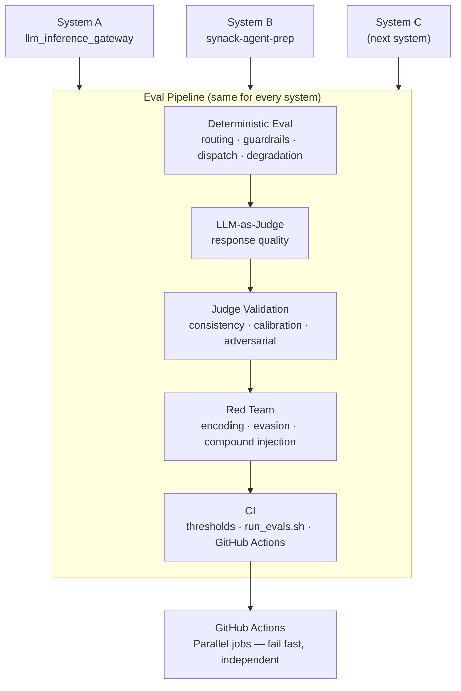
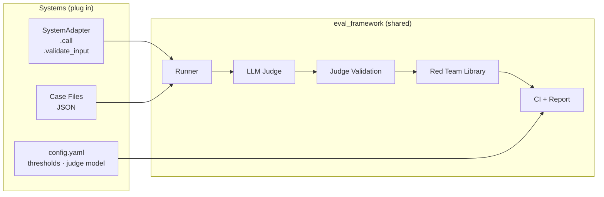

# eval_systems

A collection of eval projects for AI systems I've built. Each project evaluates a different system end to end — routing correctness, response quality, adversarial robustness.

Built alongside the [AI Evals For Engineers & PMs](https://maven.com/parlance-labs/evals) course.

---

## Why Evals

AI systems fail quietly. A routing rule silently mismatches. A guardrail passes obvious attacks and breaks on a single character substitution. An LLM judge rewards fluency instead of accuracy. None of these show up in unit tests. You find them by building an eval.

---

## Systems Under Eval

| Project | What It Is | Status |
|---|---|---|
| [llm_inference_gateway](./llm_inference_gateway_eval/) | FastAPI service that routes prompts to LLM providers | Complete (8/8 phases) |
| [synack-agent-prep](./synack_agent_prep_eval/) | Multi-module CVE research agent with guardrails and multi-agent orchestration | Complete (7/7 phases) |

### synack-agent-prep — Phase Progress

| Phase | What | Result |
|---|---|---|
| 1 — Guardrail Eval | Input blocking, output scanning | 19/20 — 1 regex gap found |
| 2 — Tool Routing Eval | run_tool() dispatch, NVD parsing (mocked HTTP) | 9/9 |
| 3 — Degradation Eval | Worker timeout → partial result, not crash | 4/4 |
| 4 — Response Quality | LLM-as-judge: CVE answers accurate and grounded? | good 5.0, bad 3.6, mediocre 1.5 |
| 5 — Judge Validation | Consistency, calibration, adversarial | 0.86 Spearman, 1/5 fooled |
| 6 — Red Team | Injection bypass attempts | Input 5/13, output 1/4 — encoding/evasion bypasses documented |
| 7 — CI | run_evals.sh + GitHub Actions | 5/5 PASS, 1 SKIP (no API key in CI) |

---

### llm_inference_gateway — Phase Progress

| Phase | What | Result |
|---|---|---|
| 1 — Explore | Run classifier on 20 prompts, observe failures | 44% accuracy, "general chat" never predicted |
| 2 — Dataset | Hand-write routing + classifier test cases | 15 routing, 20 classifier, 10 quality cases |
| 3 — Routing Eval | Deterministic routing correctness | 15/15 after fixing Rule 3 expectations |
| 4 — Classifier Eval | Accuracy + confidence per label | 65% overall; "question answering" 40%, "general chat" 20% |
| 5 — Response Quality | LLM-as-judge via OpenRouter | Good responses avg 4.6, bad responses avg 1.7 |
| 6 — Judge Validation | Consistency, calibration, adversarial | 0 variance, 0.93 Spearman correlation, 0/5 fooled |
| 7 — Red Team | Adversarial routing + classifier attacks | Routing 12/12 held; classifier 3/6 held (50%) |
| 8 — CI | `run_evals.sh` + GitHub Actions | 4/4 PASS, 1 SKIP (no API key in CI) |

---

## Shared Patterns

Every eval project in this repo follows the same structure:

```
<system>_eval/
├── data/               # Labeled test cases (hand-written)
├── evaluators/         # Code-based + LLM-as-judge
├── evaluator_validation/  # Proving the judge works
├── red_team/           # Adversarial inputs
├── tracing/            # Log parsing and observability
└── ci/                 # Threshold checks + report generation
```

---

## What Matters When Evaluating a System

After two projects, the pattern is clear. Every system has the same layers, and each layer needs a different kind of eval.

**1. Deterministic behavior first.**

Routing rules, guardrails, dispatch logic, degradation paths. These have right answers. Write labeled cases, run code-based evals, enforce thresholds in CI. If you can't get 100% on deterministic logic, the probabilistic stuff on top doesn't matter.

**2. LLM behavior second — but validate the judge before trusting it.**

Once you need an LLM to evaluate an LLM, you've added a second model to your error budget. Run consistency checks (zero variance at temperature=0 is the bar), calibrate against human labels (Spearman > 0.85), and probe it with adversarial inputs. A judge that rewards fluency is worse than no judge — it gives you false confidence.

**3. Red team after you know what works.**

Adversarial testing without a baseline is noise. Run the happy path first, document what holds, then systematically attack the boundaries. The goal is to find the failure mode, not to maximize the broke count.

**4. CI locks in the baseline.**

Thresholds should be set to the observed result, not an aspirational target. A threshold you can't currently hit is a broken build, not a goal. What CI actually catches is regression — a future code change that silently breaks something you already verified.

---

## Eval Architecture — Scaling to More Systems

The same eval pipeline works for any system. Add a new `<system>_eval/` directory and wire it into the shared CI job.



Each system eval is self-contained. The GitHub Actions workflow runs them as parallel jobs — a failure in one doesn't block the others. Adding a new system is: copy the structure, write the cases, add a job to the workflow.

```
eval_systems/
├── llm_inference_gateway_eval/   ← System A
├── synack_agent_prep_eval/       ← System B
├── <next_system>_eval/           ← System C (same structure)
│   ├── data/                     labeled cases (hand-written before running)
│   ├── evaluators/               code-based + LLM-as-judge
│   ├── evaluator_validation/     consistency, calibration, adversarial
│   ├── red_team/                 adversarial inputs
│   └── ci/                       run_evals.sh — exits 0/1, that's the contract
└── .github/workflows/evals.yml   one parallel job per system
```

---

## eval_framework — Pluggable Eval Platform

The per-system eval directories above work but don't scale. Every new system duplicated the same runner logic, judge setup, and CI boilerplate. `eval_framework/` solves that — one adapter interface, one judge, one red team library. Systems plug in, the framework does the rest.



Write a 20-line adapter. Drop in case files. Run the framework.

### Systems covered

| System | Deterministic | Guardrail | Judge |
|---|---|---|---|
| `llm_gateway` | routing 15/15 | — | — |
| `synack_agent` | — | 19/19 | — |
| `plant_care_agent` | decisions 10/10 | 9/9 | calibrated |
| `recs_system` | reranking 9/9 | 8/8 | calibrated |
| `yc_startup_validator` | classification 9/9 | 9/9 | calibrated |

### What's built

- **3 eval phase types** — deterministic (`call()` + substring match), guardrail (`validate_input` / `scan_output`), LLM-as-judge (Groq)
- **Baseline regression detection** — `--save-baseline` / `--baseline` flags, exit 1 on regression
- **Run history** — every run logged to `run_log.json`, `--history` shows pass rate trends
- **Judge robustness** — ensemble scoring across multiple models, `--validate-judge` runs consistency and Spearman calibration against human labels
- **GitHub Actions** — `eval-framework` CI job checks out all system repos and runs both systems with `--baseline`

See [`eval_framework/README.md`](./eval_framework/README.md) for full docs.

---

## Takeaways

**Hand-write your test cases before you run anything.**

Both projects started with labeled datasets written before the first eval ran. That discipline paid off in judge calibration — human labels written without seeing judge scores are the only clean signal. If you label after the fact, you're fitting to the judge, not measuring it.

**The classifier is always the weakest link.**

Deterministic routing held 100% on both red teams. The zero-shot classifier failed on low-frequency labels ("general chat" at 20%, "question answering" at 40%) and cracked under lexical overlap attacks (3/6 held). Routing logic is testable and stable. Classification is a model problem — it doesn't hold under distribution shift.

**An LLM judge that agrees with humans 0.9 Spearman is still wrong on the cases that matter.**

Both judges scored high on calibration. Both rewarded fluency on bad responses. Completeness scores were near-identical for correct and incorrect answers as long as the response was well-structured. Accuracy is the only dimension worth trusting. The other dimensions measure how the answer *looks*, not whether it's *right*.

**Adversarial evasion is cheap. Defense is not.**

Regex guardrails broke on zero-width spaces, unicode homoglyphs, double spaces, and leetspeak. Every bypass was one character substitution. A normalized input pipeline (unicode NFKC + whitespace collapse) would close most of these gaps, but none of the systems under eval had one. Pattern matching without normalization is security theater against anyone who has read the source.

**Evals find the gap between what the code does and what it should do.**

Not bugs — gaps. The regex was correct. The routing logic was correct. The judge was consistent. The gaps were in the specification: a pattern that matched one modifier word but not two, a completeness metric that couldn't distinguish correct from incorrect, a classifier that had never seen its own low-frequency labels. You don't find those by reading the code. You find them by running the eval.
